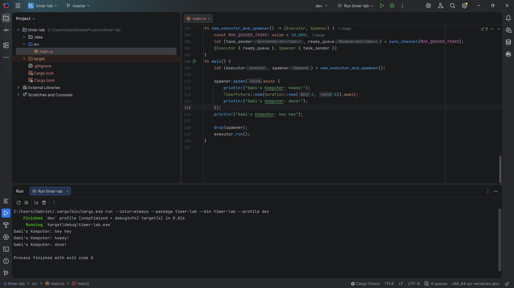
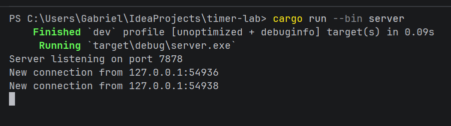
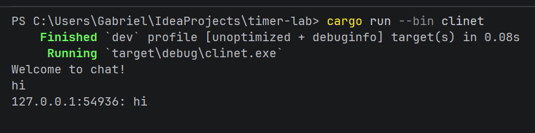
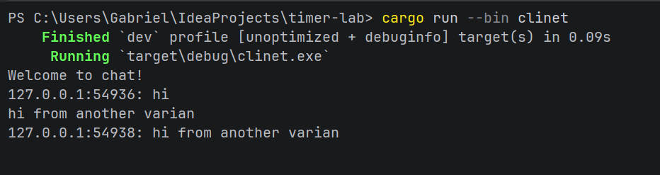

Nama : Gabriel S.A.Fenanlampir
NPM: 2306315516
README TOTORIAL MODUL10;

Tutor 1:

Refleksi:
Asynchronous programming memungkinkan unit kerja berjalan terpisah dari main thread aplikasi dan memberikan notifikasi saat selesai. Dalam kasus ini, saat spawn dipanggil, tugas tersebut segera dimulai namun tidak memblokir eksekusi kode selanjutnya. Sistem tidak menunggu timer selama 2 detik selesai untuk menjalankan perintah cetak "hey hey". Hal ini menunjukkan bahwa alur kontrol dapat berpindah untuk melakukan pekerjaan lain sementara operasi asinkron sedang berjalan. Dengan model ini, aplikasi tetap responsif meskipun ada tugas yang membutuhkan waktu tunggu lama seperti akses I/O atau timer.

Tutor 1:

refleksi:
Tutorial 2: Broadcast Chat
2.2. Modifying the Port
Pada eksperimen ini, saya melakukan modifikasi port koneksi pada aplikasi broadcast chat dari port bawaan menjadi port 7878 (seperti yang terlihat pada tangkapan layar eksekusi). Perubahan ini mengharuskan pembaruan pada dua sisi aplikasi, yaitu pada sisi server melalui TcpListener::bind("127.0.0.1:7878") dan pada sisi klien melalui ClientBuilder::from_uri(...). Modifikasi ini memberikan pemahaman mendasar bahwa komunikasi berbasis WebSocket tetap bertumpu pada protokol TCP yang mewajibkan klien dan server menyepakati alamat IP dan port yang spesifik agar handshake dapat terjadi. Selain itu, berkat penggunaan arsitektur asinkron dengan runtime Tokio, server dapat membuka satu port ini untuk menerima dan mengelola ribuan koneksi klien secara konkuren tanpa hambatan, jauh lebih efisien dibandingkan model thread-per-connection tradisional yang memakan banyak memori.

2.3. Small Changes: Add IP and Port
Pada bagian ini, saya menambahkan fitur identifikasi pengirim dengan menyematkan informasi alamat IP dan nomor port spesifik pengirim pada setiap pesan yang disebarkan (broadcast) oleh server. Implementasinya dilakukan dengan mengekstrak data SocketAddr saat klien pertama kali terhubung melalui listener.accept(), lalu memformatnya bersama pesan asli menggunakan makro format!("{}: {}", addr, text) sebelum dikirim ke channel broadcast. Eksperimen ini mendemonstrasikan keunggulan utama protokol WebSocket yang mendukung komunikasi dua arah (full-duplex) secara persisten. Berbeda dengan mekanisme polling pada HTTP biasa, di sini server bertindak aktif untuk langsung mendorong (push) pesan baru ke seluruh klien secara real-time. Keberadaan makro tokio::select! di dalam event loop juga sangat krusial, karena memastikan aliran stream dari klien dan antrean channel server dapat berjalan beriringan tanpa saling memblokir (non-blocking).
